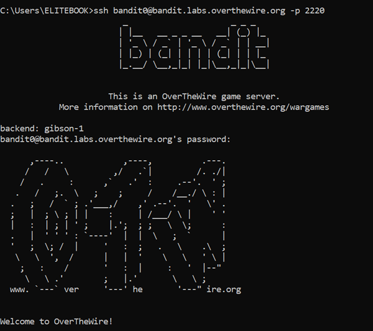
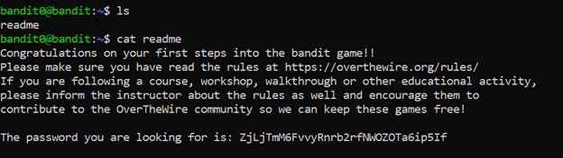

# Bandit Level 0 → Level 1

## 🎯 Level Goal

The goal of this level is to log into the Bandit game server using **SSH**.

- **Host:** bandit.labs.overthewire.org  
- **Port:** 2220  
- **Username:** bandit0  
- **Password:** bandit0  

After logging in successfully, proceed to the next level.

---

## 🔑 Solution Steps

### Step 1: Open Your Terminal

Use any terminal that supports SSH:

- Linux: Terminal  
- macOS: Terminal  
- Windows: PowerShell or Git Bash  

---

### Step 2: Connect to the Bandit Server

Run the following command:

```bash
ssh bandit0@bandit.labs.overthewire.org -p 2220
```
---

### Step 3: Enter the password

When prompted, type:
```bash
bandit0
```

---

### Step 4: Verify Successful Login

If the login is successful, you will see a welcome message similar to the following:

```text
Welcome to OverTheWire Bandit
```

You are now logged in as bandit0 and can continue to Level 1.

---

### 🧠 What You Learn from This Level

- How to connect to a remote server using SSH
- Understanding SSH username, host, and port
- Basic authentication concept in Linux

---

### Output






