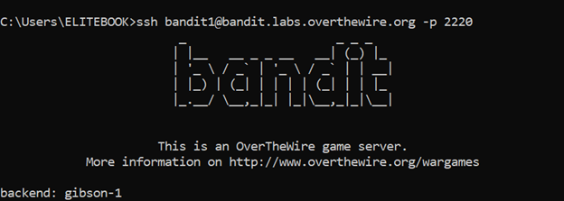
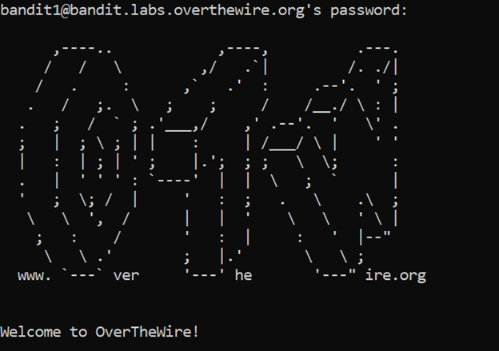
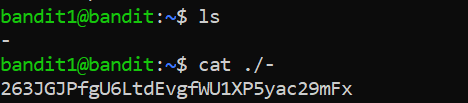

# Bandit Level 1 → Level 2

## 🎯 Level Goal

The password for the next level is stored in a file called `-` located in the home directory.

---

## 🔑 Solution Steps

### Step 1: Login to the Next Level
Use the following command to log in as bandit1:

```bash
ssh bandit1@bandit.labs.overthewire.org -p 2220
```
---

### Step 2: Enter the password obtaines from level 0

### Step 3: List Files in the Home Directory

Run the following command to see the files:

```bash
ls
```
You will notice a file named -

---

### Step 4: Read the File Named -
Since - is treated as a special character in Linux, we must explicitly specify its path.

```bash
cat ./-
```
---

### Step 5: Copy the Password
The output of the above command is the password for bandit2.
Copy this password carefully.

---

### Step 6: Login to the Next Level
Use the following command to log in as bandit2:

```bash
ssh bandit2@bandit.labs.overthewire.org -p 2220
```
When prompted, paste the password obtained from Step 3.

---

### 🧠 What You Learn from This Level
- How Linux handles special characters in filenames

- Why ./ is required for certain filenames

- How to safely access files with unusual names

- Reinforcement of SSH login workflow

---

### Output





