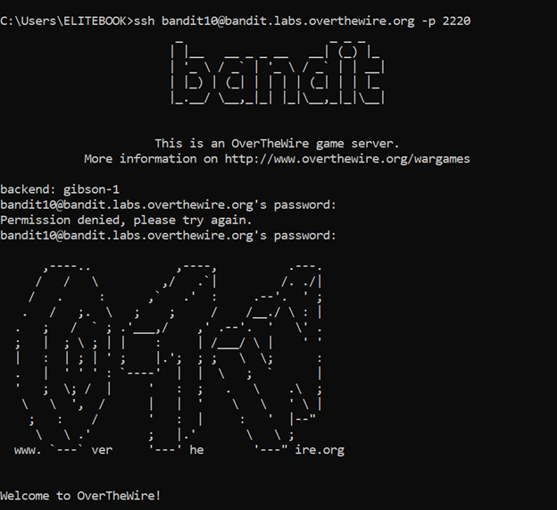

# Bandit Level 10 → Level 11

## 🎯 Level Goal

The password for the next level is stored in the file `data.txt` and is **base64 encoded**.

---

## 🔑 Solution Steps

### Step 1: View the File Content

First, check what’s inside the file:

```bash
cat data.txt
```
You will see that the content looks encoded and not normal readable text.

---

### Step 2: Decode the Base64 Data
Use the base64 command to decode the file:

```bash
base64 -d data.txt
```
This will output the decoded text, which is the password for the next level.

---

### Step 3: Copy the Password
Copy the decoded output shown in the terminal.

---

### Step 4: Login to the Next Level
Use the decoded password to log in as bandit11:
```bash
ssh bandit11@bandit.labs.overthewire.org -p 2220
```
Paste the password when prompted.

---

### 🧠 What You Learn from This Level
- What Base64 encoding is

- How to decode Base64 data in Linux

- Difference between encoding and encryption

- Using command-line tools to transform data

---

### Output



