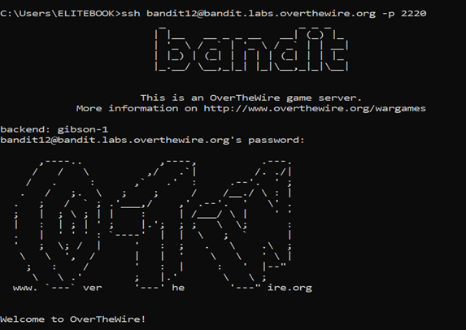
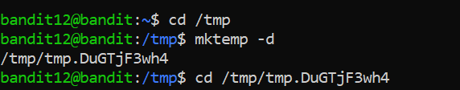
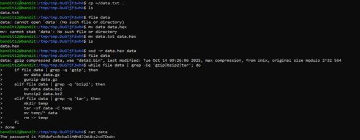

# Bandit Level 12 → Level 13

## 🎯 Level Goal

The password for the next level is stored in `data.txt`, which is a **hexdump of a file that has been repeatedly compressed** using different formats.

You need to:
- Convert the hexdump back into a binary file  
- Automatically detect the file type  
- Repeatedly decompress it until you get a readable text file  

---

## 🔑 Solution Steps

### Step 1: Create a Temporary Working Directory

```bash
cd /tmp
mktemp -d
```
copy data.txt into temporary working directory
```bash
cp ~/data.txt .
```

---

### Step 2: Convert Hexdump Back to Binary
```bash
xxd -r data.txt > data
```

---

### Step 3: Decompress Step by Step  (Method 1)

Depending on the file type, use the appropriate command:

For gzip:
```bash
mv data.bin data.gz
gunzip data.gz
```

For bzip2:

```bash
mv data.bin data.bz2
bunzip2 data.bz2
```

For tar:

```bash
tar -xf data.tar
```
After each extraction, run:
```bash
file <filename>
```
and repeat the process until you get a normal text file.

### Step 3: Use a Loop to Decompress Automatically (Method 2)
We will keep checking the file type and extracting it until it becomes plain text.
```bash
file data
```
Now run this loop:

```bash
while true; do
  type=$(file data)
  if [[ $type == *"gzip"* ]]; then
    mv data data.gz
    gunzip data.gz
  elif [[ $type == *"bzip2"* ]]; then
    mv data data.bz2
    bunzip2 data.bz2
  elif [[ $type == *"tar"* ]]; then
    mv data data.tar
    tar -xf data.tar
    rm data.tar
    mv * data
  else
    break
  fi
done
```

---

### Step 4: Read the Final File
```bash
cat data
```
The output is the password for bandit13.

---

### Step 5: Login to the Next Level

```bash
ssh bandit13@bandit.labs.overthewire.org -p 2220
```

---

### 🧠 What You Learn from This Level
- Reversing a hexdump using xxd

- Detecting file types using file

- Using loops to automate repetitive tasks

- Working with gzip, bzip2, and tar files

- Practical shell scripting for real-world problems

---

### Output






