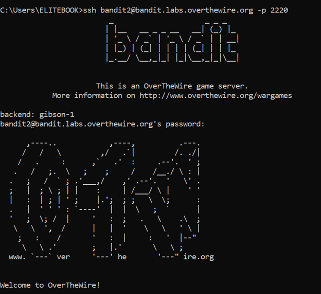
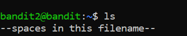
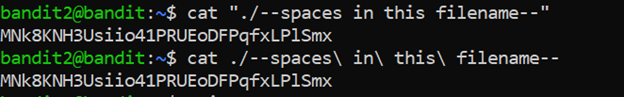

# Bandit Level 2 → Level 3

## 🎯 Level Goal

The password for the next level is stored in a file called  
`spaces in this filename` located in the home directory.

---

## 🔑 Solution Steps

### Step 1: List Files in the Home Directory

Run the following command to see the files:

```bash
ls
```
You will see a file with spaces in its name.

---

### Step 2: Read the File with Spaces in Its Name
Since the filename contains spaces, we must use quotes.

```bash
cat "spaces in this filename"
```

---

### Step 3: Copy the Password
The output of the command is the password for bandit3.
Copy this password carefully.

---

### Step 4: Login to the Next Level
Use the following command to log in as bandit3:

```bash
ssh bandit3@bandit.labs.overthewire.org -p 2220
```
When prompted, paste the password obtained from Step 3.

---

### 🧠 What You Learn from This Level
- How Linux treats spaces as separators

- How to use quotes to handle filenames with spaces

- Proper file access techniques in Linux

- Continued practice with SSH login

---

### Output





