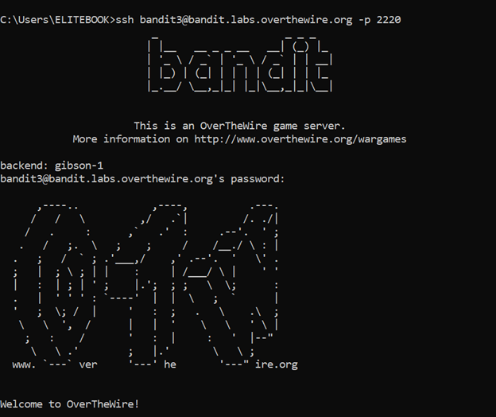
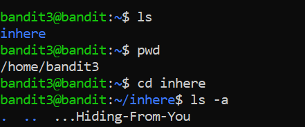
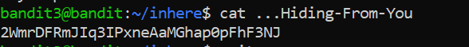

# Bandit Level 3 → Level 4

## 🎯 Level Goal

The password for the next level is stored in a **hidden file** inside the `inhere` directory.

---

## 🔑 Solution Steps

### Step 1: Move into the `inhere` Directory

```bash
cd inhere
```
---

### Step 2: List All Files Including Hidden Files
Hidden files in Linux start with a dot (.).
Use the following command to list them:

```bash
ls -a
```
You will see a hidden file (e.g., .hidden).

---

### Step 3: Read the Hidden File

```bash
cat .hidden
```

---

### Step 4: Login to the Next Level
The output of the previous command is the password for bandit4.

```bash
ssh bandit4@bandit.labs.overthewire.org -p 2220
```
Paste the password when prompted.

---

### 🧠 What You Learn from This Level
- What hidden files are in Linux

- How to list hidden files using ls -a

- How to access files starting with a dot (.)

- Practical directory navigation

---

### Output





