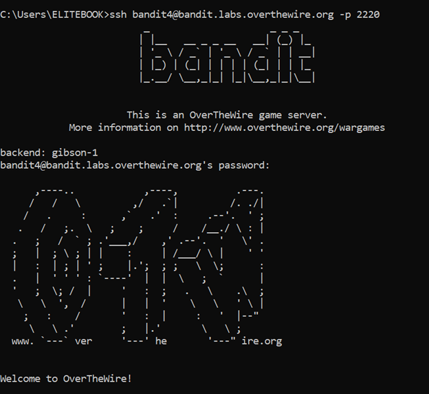
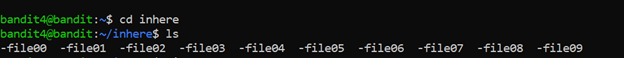
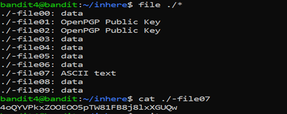

# Bandit Level 4 → Level 5

## 🎯 Level Goal

The password for the next level is stored in the **only human-readable file** in the `inhere` directory.

---

## 🔑 Solution Steps

### Step 1: Move into the `inhere` Directory

```bash
cd inhere
```

---

### Step 2: List All Files
```bash
ls
```
You will see multiple files with different names.

--- 

### Step 3: Identify the Human-Readable File
Use the file command to check the type of each file:
```bash
file ./*
```
Look for the file that is identified as ASCII text.

---

### Step 4: Read the Human-Readable File
Replace <filename> with the actual file name identified in the previous step.
```bash
cat <filename>
```

---

### Step 5: Login to the Next Level
The output of the file is the password for bandit5.
```bash
ssh bandit5@bandit.labs.overthewire.org -p 2220
```
Paste the password when prompted.

---

### 🧠 What You Learn from This Level
- How to identify file types in Linux

- Difference between binary and text files

- Practical use of the file command

- Safe handling of multiple unknown files

---

### Output





