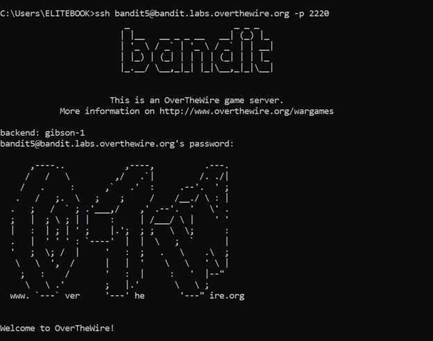
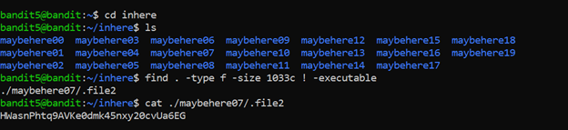

# Bandit Level 5 → Level 6

## 🎯 Level Goal

The password for the next level is stored in a file somewhere under the `inhere` directory and has the following properties:

- Human-readable  
- Exactly **1033 bytes** in size  
- Not executable  

---

## 🔑 Solution Steps

### Step 1: Move into the `inhere` Directory

```bash
cd inhere
```

---

### Step 2: Search for the File Using find
Use the find command with the given conditions:
```bash
find . -type f -size 1033c ! -executable
```

---

### Step 3: Read the File
The command will return the file path that matches all conditions.
Read the file using cat:
```bash
cat <file_path>
```

---

### Step 4: Login to the Next Level
The output of the file is the password for bandit6.
```bash
ssh bandit6@bandit.labs.overthewire.org -p 2220
```
Paste the password when prompted.

---

### 🧠 What You Learn from This Level
- Advanced usage of the find command

- Searching files based on size and permissions

- Understanding executable vs non-executable files

- Efficient file discovery in large directories

---

### Output



