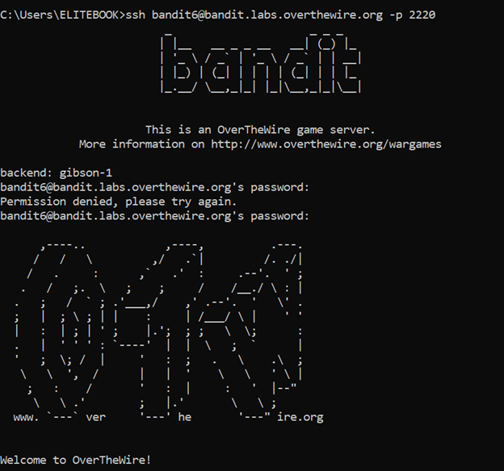
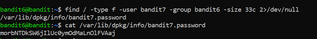

# Bandit Level 6 → Level 7

## 🎯 Level Goal

The password for the next level is stored **somewhere on the server** and has the following properties:

- Owned by user **bandit7**  
- Owned by group **bandit6**  
- Exactly **33 bytes** in size  

---

## 🔑 Solution Steps

### Step 1: Search for the File Using find

Since the file can be anywhere on the system, we use the `find` command with the given conditions:

```bash
find / -type f -user bandit7 -group bandit6 -size 33c 2>/dev/null
```
2>/dev/null is used to hide permission denied errors.

---

### Step 2: Read the File
The command will return the correct file path.
Read the file using cat:
```bash
cat <file_path>
```

---

### Step 3: Login to the Next Level
The output of the file is the password for bandit7.
Use it to log in:
```bash
ssh bandit7@bandit.labs.overthewire.org -p 2220
```
Paste the password when prompted.

---

### 🧠 What You Learn from This Level
- Searching files across the entire system using find

- Filtering files by owner, group, and size

- Handling permission errors using output redirection

- Efficient file discovery on large Linux systems

---

### Output



