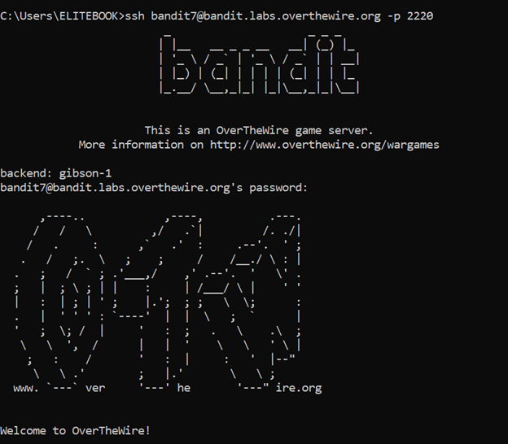
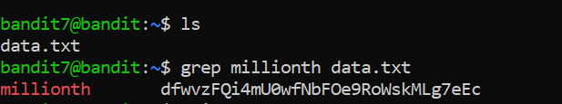

# Bandit Level 7 → Level 8

## 🎯 Level Goal

The password for the next level is stored in the file `data.txt` **next to the word `millionth`**.

---

## 🔑 Solution Steps

### Step 1: View the Contents of the File

First, list and inspect the file:

```bash
ls
cat data.txt
```
Since the file is very large, manually searching is inefficient.

---

### Step 2: Search for the Word "millionth"
Use the grep command to find the line containing the word millionth:
```bash
grep "millionth" data.txt
```

---

### Step 3: Login to the Next Level
The output of the command will contain the password for bandit8.

Use it to log in:
```bash
ssh bandit8@bandit.labs.overthewire.org -p 2220
```
Paste the password when prompted.

---

### 🧠 What You Learn from This Level
- Searching text inside files using grep

- Efficiently handling large text files

- Extracting specific information from structured data

---

### Output



