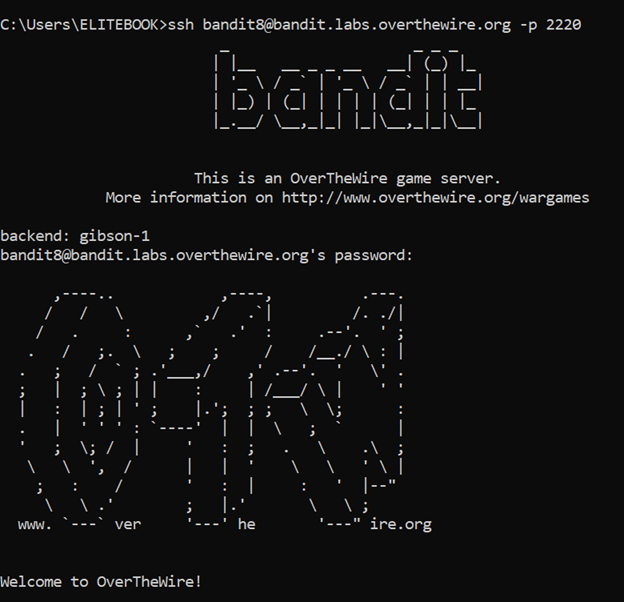
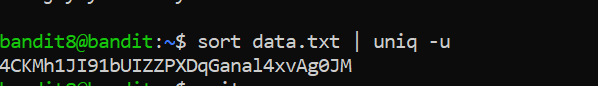

# Bandit Level 8 → Level 9

## 🎯 Level Goal

The password for the next level is stored in the file `data.txt` and is the **only line of text that occurs only once**.

---

## 🔑 Solution Steps

### Step 1: View the File

Check the contents of the file:

```bash
cat data.txt
```
The file contains many repeated lines.

---

### Step 2: Find the Unique Line
Use sort and uniq to find the line that appears only once:
```bash
sort data.txt | uniq -u
```

---

### Step 3: Login to the Next Level
The output of the command is the password for bandit9.

Use it to log in:
```bash
ssh bandit9@bandit.labs.overthewire.org -p 2220
```
Paste the password when prompted.

---

### 🧠 What You Learn from This Level
- Sorting text using sort

- Finding unique lines using uniq

- Combining commands using pipes (|)

- Processing large text files efficiently

---

### Output



