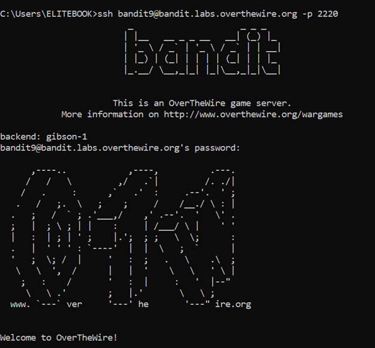
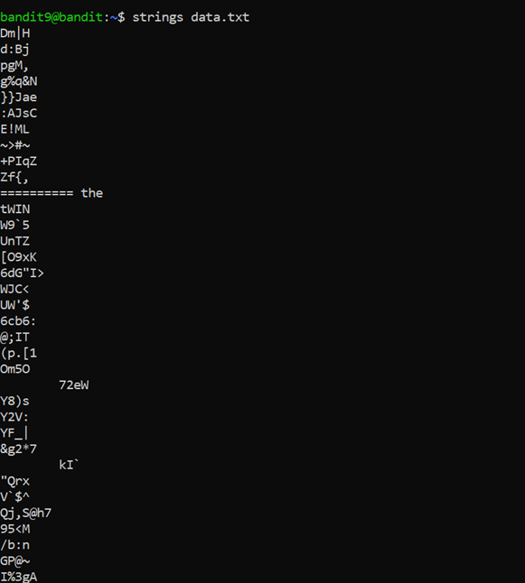
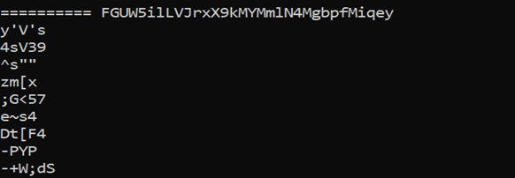

# Bandit Level 9 → Level 10

## 🎯 Level Goal

The password for the next level is stored in the file `data.txt` in one of the **few human-readable strings**, preceded by several `=` characters.

---

## 🔑 Solution Steps

### Step 1: Inspect the File

First, check the file type:

```bash
file data.txt
```
You will see that the file is a binary file, so using cat directly is not useful.

---

### Step 2: Extract Human-Readable Strings
Use the strings command to extract readable text from the binary file and filter the result:

```bash
strings data.txt
```
To directly find the line with = characters, you can use:

```bash
strings data.txt | grep "==="
```

---

### Step 3: Identify the Password
The output line containing multiple = characters will also contain the password.
Copy that password.

---

### Step 4: Login to the Next Level
Use the extracted password to log in as bandit10:
```bash
ssh bandit10@bandit.labs.overthewire.org -p 2220
```
Paste the password when prompted.

### 🧠 What You Learn from This Level
- Understanding binary vs text files

- Using strings to extract readable data from binaries

- Filtering command output using grep

- Efficient analysis of unknown file formats

---

### Output





